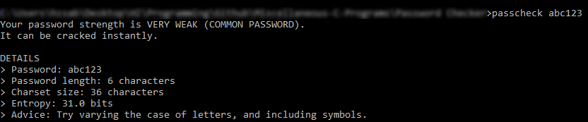
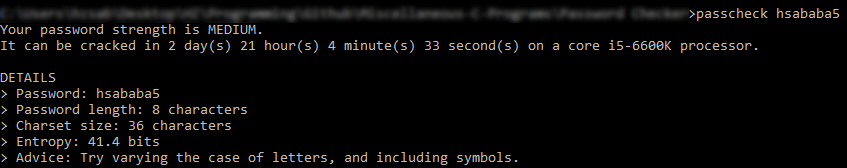
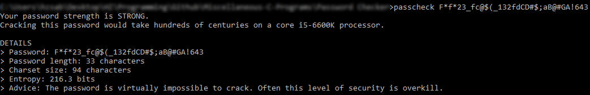

# Password Checker

> Password analyzer in C

Determines the strength of a given password. The features will be demonstrated below through examples with passwords of different strengths.

## 1. A password that is too popular

The list of common passwords in `commonPasswords.dat` is used to check if the password inserted is too common.

## 2. A weak password

## 3. A medium security-level password

## 4. A strong password

## 5. An ultra strong password

## Meta

H. Z. Sababa &mdash; hb20007 &mdash; hzsababa@outlook.com

Distributed under the MIT license. See `LICENSE.md` for more information.

https://github.com/hb20007