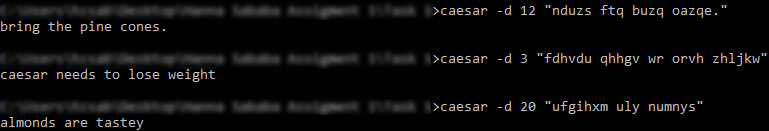
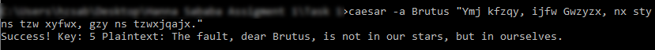

# Caesar Cipher

> Caesar cipher implementation in C

The program has 4 features:
* Encryption (`-e`)
* Decryption (`-d`)
* Brute force attack (`-a`)
* Brute force attack with known substring (`-a substring`)

## 1. Encryption

A key (right shift index) in the range [1, 25] must be specified. examples below:

## 2. Decryption

The key should be known and provided.

## 3. Brute force attack

Displays decryption of the given message with all possible keys (highlighting not a feature).

## 4. Brute force attack with known substring

Decrypts a ciphertext with an unknown key when you know a word in the plaintext (case-sensitive).

## Meta

H. Z. Sababa &mdash; hb20007 &mdash; hzsababa@outlook.com

Distributed under the MIT license. See `LICENSE.md` for more information.

https://github.com/hb20007
